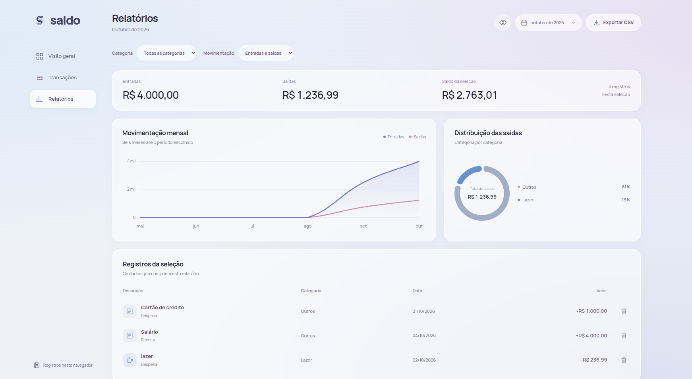
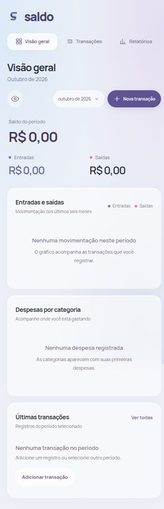

# Saldo · Dashboard Finance

Um dashboard para acompanhar entradas, saídas e o saldo do mês. Feito com Vue e Nuxt, com painéis de vidro, tons de azul e lilás e uma interface adaptada para desktop e celular.

[Abrir o Saldo](https://teal-raindrop-900d17.netlify.app/)



## O que dá para fazer

- Cadastrar, editar e excluir receitas e despesas.
- Escolher o mês e buscar transações por descrição ou categoria.
- Comparar entradas e saídas dos últimos seis meses.
- Ver a distribuição das despesas por categoria.
- Filtrar relatórios e exportar a seleção em CSV.
- Ocultar valores na interface.

O dashboard começa sem transações. Saldo, relatórios e gráficos são calculados exclusivamente a partir dos registros inseridos pelo usuário. Não há modo de demonstração nem preenchimento automático com dados fictícios.

Os registros ficam no `localStorage` deste navegador. Não há conexão com bancos, login ou sincronização entre dispositivos. Registros válidos da versão anterior continuam sendo carregados. Ao migrar da antiga demonstração, os exemplos são separados dos registros adicionados pelo usuário; uma cópia do conteúdo anterior é preservada no navegador. A exportação CSV permite guardar uma cópia dos dados; a interface ainda não oferece importação.

## Rodar localmente

Requer Node.js 22.6 ou superior.

```bash
npm ci
npm run dev
```

O endereço local aparece no terminal. Para escolher uma porta:

```bash
npm run dev -- --host 127.0.0.1 --port 5190
```

## Verificação e produção

```bash
npm test
npm run typecheck
npm run build
npm run preview
```

Os testes cobrem cálculos em centavos, datas, preservação dos registros, ordenação dos meses, categorias, ordenação das transações e geração de CSV.

## Publicação

O arquivo `netlify.toml` configura Node.js 22, geração estática com `npm run generate` e publicação de `.output/public`. O preset `static` é definido explicitamente para manter a mesma pasta de saída no Netlify e no ambiente local. As páginas de visão geral, transações e relatórios são geradas para acesso direto.

## Interface e tecnologias

Vue 3, Nuxt 3, TypeScript, Chart.js e vue-chartjs. A marca vetorial e os componentes visuais são implementados no próprio projeto. A fonte Manrope é servida localmente; sua licença está em `public/fonts/OFL-Manrope.txt`.

As transições respeitam a preferência de movimento reduzido. Os formulários usam diálogo nativo, navegação por teclado e retorno de foco. Os gráficos incluem descrições dos valores para leitores de tela.

<details>
<summary>Ver a interface no celular</summary>



</details>

Feito por Giselly Pereira.
